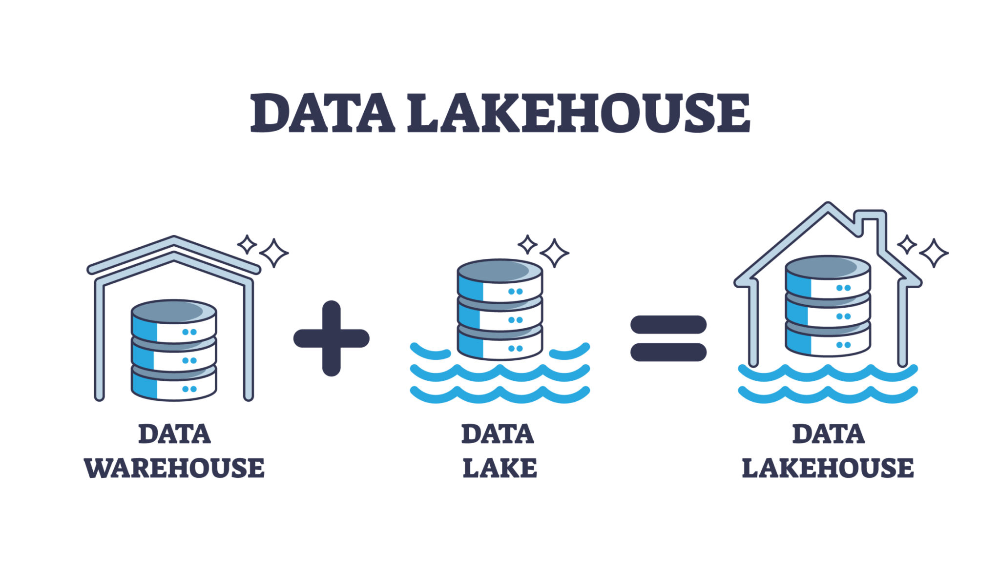
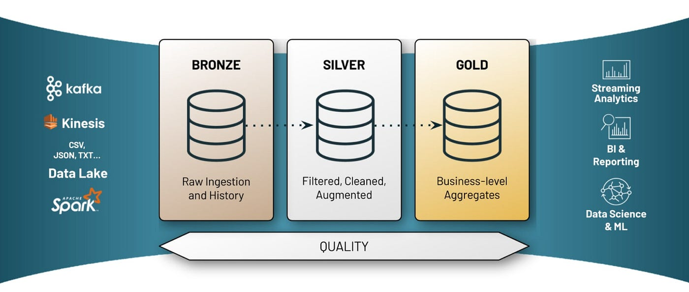
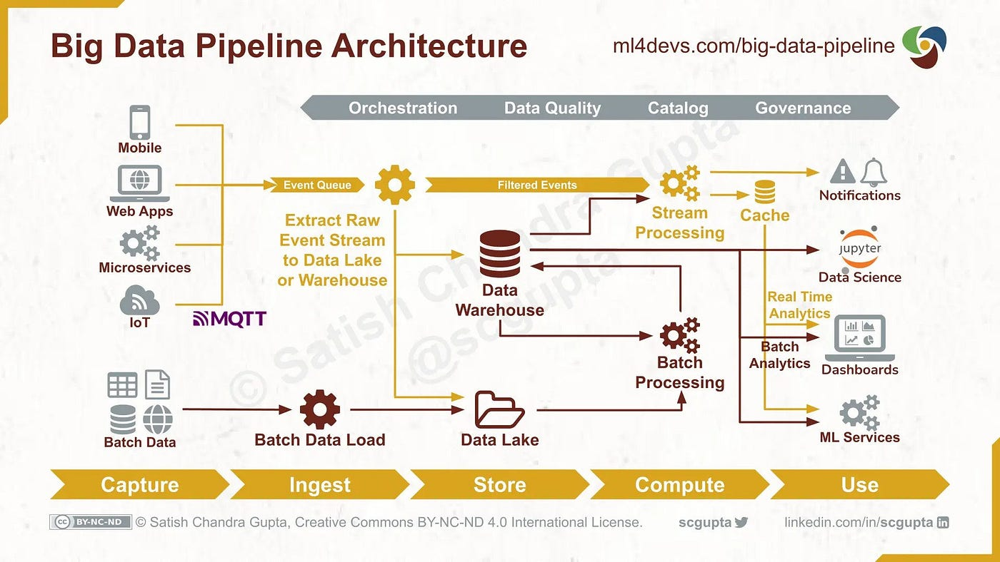
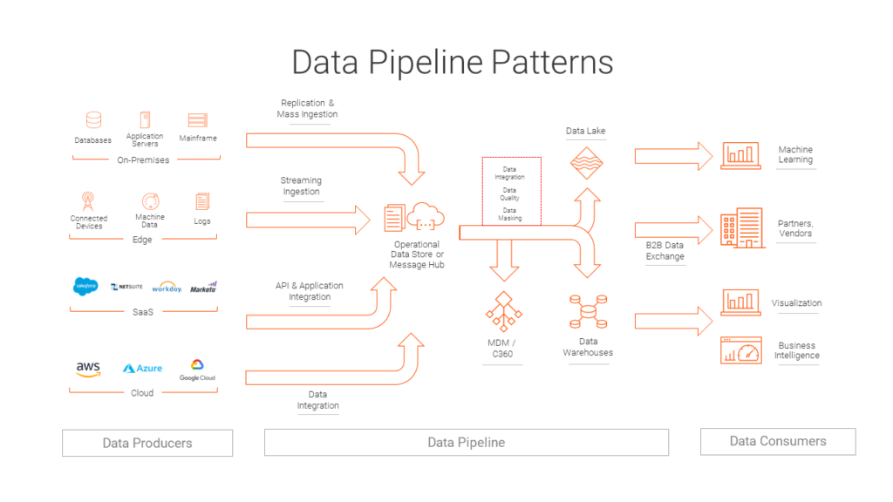
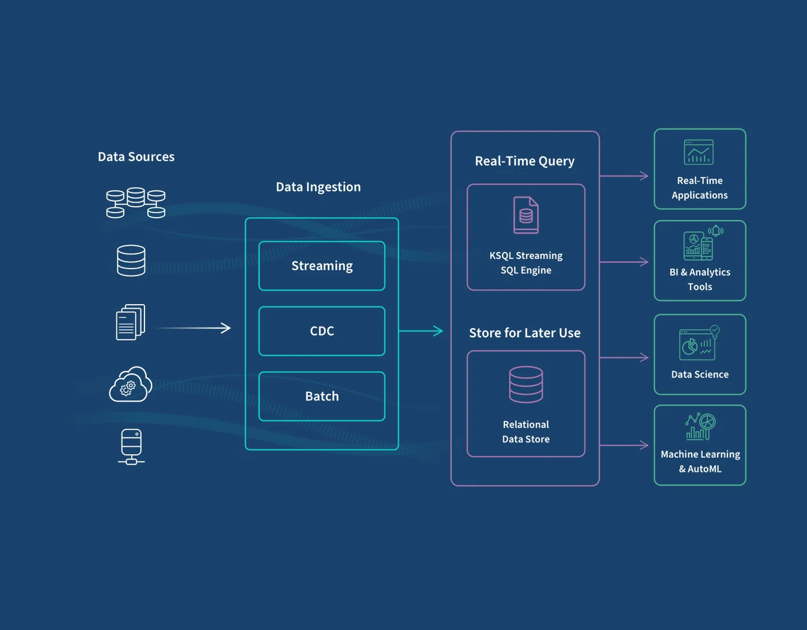

# RiskLens Security Risk And FDI Analytics Platform

### Data lakehouse as system combination from warehouse and lake outline diagram

### Medallion Achitecture(Bronze,Silver And Gold)

### Understanding Data Pipelines(Architecture and Workflow)

Data Pipeline(Data Engineering)
## Overview

RiskLens is a production-grade, open-source data platform designed to analyse how security risks and governance quality influence Foreign Direct Investment (FDI) outcomes.
It was built using modern data-engineering principles (Lakehouse, Medallion Architecture, data quality, SLAs). The platform ingests authoritative global datasets, models them for analytics performance, and exposes policy-ready insights for researchers, analysts and decision-makers.
## Problem Statement
Investment decisions are increasingly shaped by most of the following:
- security risks (terrorism, instability),

- governance quality (corruption, institutional strength)

- macroeconomic fundamentals.

However, these signals are often
isolated across sources,
inconsistently structured
and difficult to analyse at scale.
RiskLens addresses this problemsby providing
a reproducible ingestion pipeline,
a governed analytics data model
and a foundation for evidence-based policy and investment analysis.
## Architecture pattern: Lakehouse with Medallion layers

Data lakehouse

Medallion Architecture

Data Ingestion
### Layers
Bronze (Raw): Source-faithful ingested datasets

Silver (Cleaned): Validated, standardised, analytics-ready data

Gold (Serving): Star-schema facts and dimensions optimised for BI
### Key design principles
Config-driven pipelines

Clear separation of concerns

Data quality enforcement

Reproducibility and versioning.
## Tech Stack
| Layer           | Tools                       |
| --------------- | --------------------------- |
| Language        | Python                      |
| Ingestion       | Requests, Pandas            |
| Storage         | Parquet (Lakehouse style)   |          |
| Configuration   | YAML                        |
| Analytics       | DuckDB / Power BI |
| Version Control | Git and GitHub                |
## Data Sources (Public, reputable, and policy-relevant)
| Dataset               | Description                            |
| --------------------- | -------------------------------------- |
| World Bank – FDI      | Foreign direct investment, net inflows |
| Governance Indicators | Institutional quality and stability      |
| Corruption Index      | Perceived corruption proxy             |
| Terrorism Data        | Security risk proxy                    |

